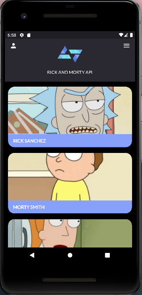
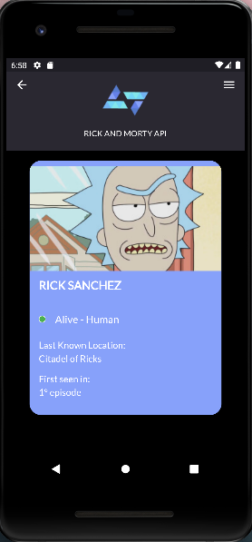

<p align="center">
  
</p>

<h1 align="center">Rick And Morty App</h2>

## 📝 About
The Rick And Morty app is an app developed in Flutter that displays characters from the Rick and Morty series and shows some of their information.

## :heavy_check_mark: Result:

### Home Page:
 <p align="center">
  
</p>

### Detail Page:
 <p align="center">
  
</p>

## ✨ How to use

1. Clone the repository :

```sh
  $ git clone https://github.com/thalytabdn/RickAndMortyApp
```

2. Running the application:

```sh
## Install the dependencies
  $ flutter pub get

## Start the application
  $ flutter run
```